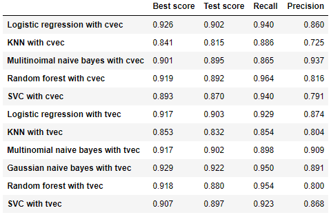
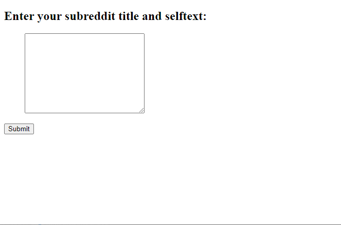

# Project 3: Web APIs & NLP

### Problem Statement

The purpose of this project is to create a classifier to judge which subreddit a given post is from, the sewing subreddit or the 3Dprinting subreddit.

---

### Datasets

Data are collected from [reddit](https://www.reddit.com/) using [Pushshift's API](https://github.com/pushshift/api).

The data were extracted from the [sewing subreddit](https://www.reddit.com/r/sewing/) and the [3Dprinting subreddit](https://www.reddit.com/r/3Dprinting/).

#### Data dictionary
The data below are [sewing_raw.csv](./data/sewing_raw.csv) and [3dprinting_raw.csv](./datasets/3dprinting_raw.csv).
Those features were used for modeling.

|Feature|Type|Dataset|Description|
|---|---|---|---|
|**subreddit**|*string*|sewing_raw, 3dprinting_raw| The subrreddit where the data is from |
|**title**|*string*|sewing_raw, 3dprinting_raw| The post title | 
|**selftext**|*string*|sewing_raw, 3dprinting_raw| The text in the post |

The data below is [final.csv](./data/final.csv).
Only the combined_text was used for modeling as feature.

|Feature|Type|Dataset|Description|
|---|---|---|---|
|**subreddit**|*string*|final| The subrreddit where the data is from |
|**title**|*string*|final| The post title | 
|**selftext**|*string*|final| The text in the post |
|**combined_text**|*string*|final| The text combined title with selftext|

---

### Executive Summary

#### 1. Data Collecting
- Collect data from reddit using pushshift's API.
- Save the data as [sewing data](./data/sewing_raw.csv) and [3dprinting data](./datasets/3dprinting_raw.csv)

---

#### 2. Data Cleaning
- Clean data removing duplicated data, url from the text, etc.
- Stem the text.
- Save the data as [final](./data/final.csv)

---

#### 3. Modeling
- Modeling using CountVectorizer (logistic regression, knn, multinomial naive bayes, random forest, support vector machine)
- Modeling using TfidfVectorizer (logistic regression, knn, multinomial naive bayes, Gaussian naive bayes, random forest, support vector machine)
- Save the created models

---

#### 4. Model Evaluation
- Calculate scores for each models
- I chose the Gaussian naive bayes with tvec as the best model from the score.

---

### App
In the app folder, I made a simple web application to judge if the text is from the sewing subreddit or the 3Dprinting subreddit.
- The application was created using Flask.
- The classification model for the app is the Gaussian naive bayes with tvec
- The gif file below is an example of the web application display.

